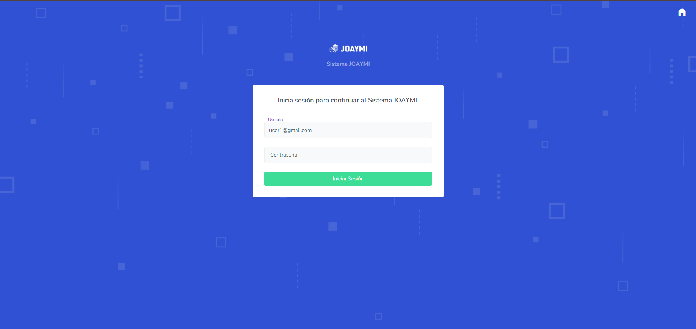
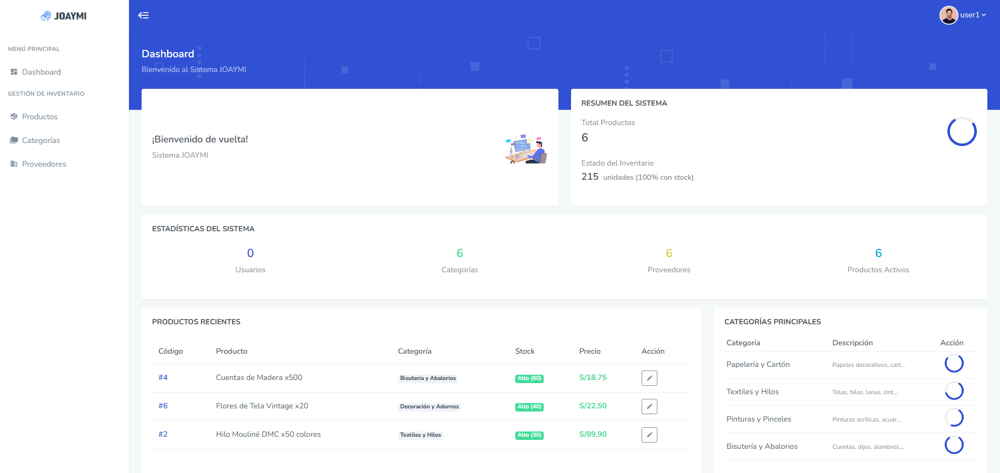
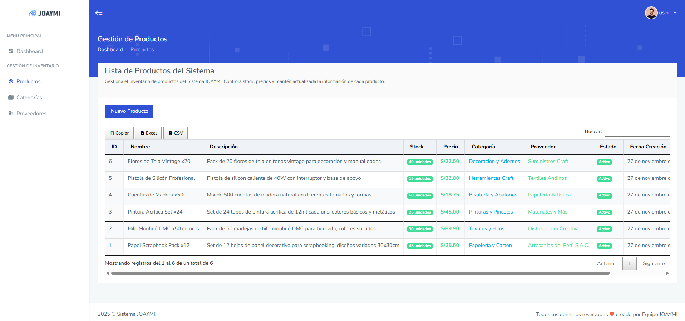
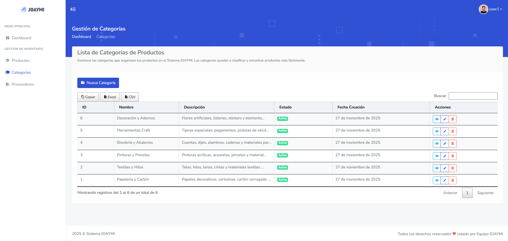

# JOAYMI - Inventory Management System

A complete inventory management system built with PHP, MySQL, and MVC architecture. This system allows you to manage products, categories, suppliers, users, and roles with a clean and intuitive interface.

## 📋 Features

- **User Authentication & Authorization**
  - Secure login system with role-based access control
  - Admin and User roles with different permissions
  - Session management and activity logging

- **Product Management**
  - Create, read, update, and delete products
  - Track stock levels and prices
  - Associate products with categories and suppliers
  - Real-time inventory updates

- **Category Management**
  - Organize products by categories
  - Full CRUD operations for categories

- **Supplier Management**
  - Manage supplier information
  - Track supplier contacts and phone numbers
  - Link suppliers to products

- **User Management**
  - Admin can create and manage users
  - Role assignment and permissions
  - User activity tracking

- **Audit Trail**
  - Complete activity logging system
  - Error logging for debugging
  - Track who created/modified records

## 🛠️ Technologies Used

- **Backend:** PHP 7.4+
- **Database:** MySQL 8.0+
- **Frontend:** HTML5, CSS3, JavaScript
- **UI Framework:** Bootstrap 5
- **Architecture:** MVC (Model-View-Controller)
- **Database Access:** PDO with prepared statements
- **Security:** Password hashing, SQL injection prevention, XSS protection

## 📁 Project Structure

```
MVC_JOAYMI/
├── config/                 # System configuration
│   ├── Sistema.php        # Main system class
│   └── inicializar_sistema.php
├── controllers/           # Application controllers
│   ├── ControladorAuth.php
│   ├── ControladorProducto.php
│   ├── ControladorCategoria.php
│   ├── ControladorProveedor.php
│   ├── ControladorUsuario.php
│   └── ControladorRol.php
├── models/               # Data models
│   ├── Usuario.php
│   ├── Producto.php
│   ├── Categoria.php
│   ├── Proveedor.php
│   └── Rol.php
├── view/                # User interface views
│   ├── Login/
│   ├── Productos/
│   ├── Categorias/
│   ├── Proveedores/
│   └── Usuarios/
├── public/              # Public assets and API endpoints
│   ├── css/
│   ├── js/
│   ├── images/
│   └── *_api.php       # RESTful API endpoints
├── sql/                # Database schema and migrations
│   └── ene29pro_joaymi.sql
└── logs/               # System and error logs

```

## 🚀 Installation

### Prerequisites

- PHP 7.4 or higher
- MySQL 8.0 or higher
- Apache/Nginx web server
- Composer (optional, for dependencies)

### Step-by-Step Setup

1. **Clone the repository**
   ```bash
   git clone https://github.com/FabricioDev0/MVC_JOAYMI.git
   cd MVC_JOAYMI
   ```

2. **Create the database**
   ```bash
   mysql -u root -p < sql/ene29pro_joaymi.sql
   ```

3. **Configure database connection**
   
   Edit `config/Sistema.php` and update the database credentials:
   ```php
   private static $configBD = [
       'host' => 'localhost',
       'dbname' => 'ene29pro_joaymi',
       'username' => 'your_username',
       'password' => 'your_password',
       'port' => '3306',
       'charset' => 'utf8mb4'
   ];
   ```

4. **Set up permissions**
   ```bash
   chmod 755 logs/
   chmod 644 logs/*.log
   ```

5. **Initialize the system**
   ```bash
   php config/inicializar_sistema.php
   ```

6. **Access the application**
   
   Open your browser and navigate to:
   ```
   http://localhost/MVC_JOAYMI
   ```

## 🔐 Default Credentials

After installation, use these credentials to log in:

- **Admin User:**
  - Email: `admin@joaymi.com`
  - Password: `admin123`

⚠️ **Important:** Change the default password immediately after first login!

## 📸 Screenshots

### Login Page


### Dashboard


### Product Management


### Category Management


## 🔒 Security Features

- **SQL Injection Prevention:** All queries use PDO prepared statements
- **XSS Protection:** Input sanitization with `htmlspecialchars()`
- **CSRF Protection:** Session-based validation
- **Password Security:** Secure password hashing
- **Role-Based Access Control:** Admin and User roles with different permissions
- **Activity Logging:** Complete audit trail of user actions

## 📊 Database Schema

The system uses a normalized database structure with the following main tables:

- `tm_usuarios` - User accounts
- `tm_roles` - User roles
- `tm_productos` - Products
- `tm_categorias` - Product categories
- `tm_proveedores` - Suppliers

All tables include audit fields:
- `fec_creacion` - Creation timestamp
- `fec_actualizacion` - Last update timestamp
- `fec_eliminacion` - Soft delete timestamp
- `cod_usuario_creador` - User who created the record
- `cod_usuario_modificador` - User who last modified the record

## 🌐 API Endpoints

The system provides RESTful API endpoints:

- `POST /public/auth_api.php?accion=login` - User login
- `GET /public/productos_api.php?accion=listar` - List all products
- `POST /public/productos_api.php?accion=insertar` - Create product
- `PUT /public/productos_api.php?accion=actualizar` - Update product
- `DELETE /public/productos_api.php?accion=eliminar` - Delete product

Similar endpoints exist for categories, suppliers, users, and roles.

## 🤝 Contributing

Contributions are welcome! Please follow these steps:

1. Fork the repository
2. Create a feature branch (`git checkout -b feature/AmazingFeature`)
3. Commit your changes (`git commit -m 'Add some AmazingFeature'`)
4. Push to the branch (`git push origin feature/AmazingFeature`)
5. Open a Pull Request

## 📝 License

This project is licensed under the MIT License - see the [LICENSE](LICENSE) file for details.

## 👤 Author

**Fabricio Dev**

- GitHub: [@FabricioDev0](https://github.com/FabricioDev0)

## 🙏 Acknowledgments

- Bootstrap team for the amazing UI framework
- PHP community for excellent documentation
- All contributors who help improve this project

---

⭐ If you find this project useful, please consider giving it a star!
